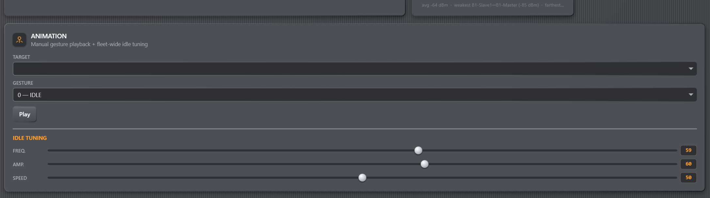

# Gestures & Idle Behavior

The Animation card is the quickest way to test one droid after calibration or
send an immediate gesture to the fleet.

*Figure: Select the target before using Play or changing the three per-droid
idle settings.*

## Pick the target first

Choose a droid in **Target** before adjusting its tuning. If no target is
selected, Play and tuning use the fleet-wide broadcast target. Before sending a
large gesture, verify the name against Locate or the physical mechanism.

## The 18 built-in gestures

The catalog ranges from small `IDLE`, `LOOK_AROUND`, and `NOD_YES` motions to
alert and glitch effects. A one-shot gesture finishes after its firmware-defined
duration.

*Figure: The same color groups appear in the Sequencer library, where a gesture
can be clicked or dragged onto a track.*

`POWER_DOWN` and `TALK` are looping gestures. They do not stop when the console
playhead stops because the gesture command has already reached the droid. Send a
different gesture to replace the loop, or disable Servos if motion must stop
immediately. `TALK` is intended to accompany PC audio; see
[Sequencer Audio](sequencer/audio.md).

Animation-card commands are intentionally operator-owned and do not use the
Sequencer's five-second safety lease. The lease applies only when Sequencer
playback starts `POWER_DOWN` or `TALK`; do not rely on it to stop a loop started
from this card.

## Automatic idle behavior

When no manual gesture owns a droid, the master selects random non-looping idle
gestures every 2.5–5 seconds. A slave that cannot hear the master but still runs
locally draws on a similar 3–7 second cadence.

Turn off **Auto anims** on a Droids row to suppress spontaneous idle gestures for
that droid. This does not disable its servos and does not block manual Animation
or Sequencer commands.

## Frequency, amplitude, and speed

- **Frequency** changes how often spontaneous gestures are selected.
- **Amplitude** scales movement offsets. Start low after mechanical work.
- **Speed** scales gesture movement and hold timing.

Values run from 0 to 100 and are stored per droid. Changing the Target requests
that droid's stored set. Slider changes wait 1.2 seconds before being sent, then
the master auto-commits its dirty working copy. Wait until the header shows
**● synced** before switching off the master. Changing targets during the initial
1.2-second debounce cancels that pending slider edit.

## Timing expectations

The console obtains gesture durations from the connected firmware. Timeline clip
widths therefore adapt when firmware timing changes. Mesh and serial delivery
still add small real-world latency; this is choreography timing, not a hard
real-time motion-control bus.
