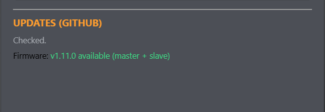

# Updating B1 Chat Console

The Firmware window checks two independent GitHub release streams: one for the
Windows console and one for master/slave firmware. A firmware release existing
does not necessarily mean every droid is behind; each Droids row compares its
reported version separately.

*Figure: This area reports the result of the current GitHub check. An Install
button appears here only when a newer console release is available.*

## Install a console update

When a newer console version exists, the **Updates (GitHub)** area shows it with
an **Install** button.

1. Stop sequence playback.
2. Save any timeline edits you need to keep. Export an external copy if desired;
   timeline work is not autosaved.
3. Choose **Install**.
4. The console downloads the release installer, launches it, and shuts down.
5. Complete the installer and relaunch the console.
6. Confirm the new version in the main header.

The last connected COM port is stored locally and is offered again after the
update. The last Local Library Scene or imported/exported sequence file may
reload, but only the last saved snapshot is recovered—not edits left solely in
memory.

## Offline or failed update checks

Fleet control does not require GitHub. If the check reports an error, continue
using local features and retry when Internet access, DNS, firewall, proxy, or
GitHub availability is restored.

Firmware downloaded through **From GitHub** is checked against its release
manifest SHA-256. A missing or invalid firmware hash causes the download to be
rejected rather than treated as verified.

## Console and firmware compatibility

The serial handshake reports firmware version, protocol version, and supported
capabilities. The console hides or falls back for some older capabilities, but
not every combination is feature-equivalent. For predictable behavior, update
the console first, then bring the master and slaves to the matching current
firmware release.

After firmware updates, verify one small gesture, one calibration read, and the
mesh roster before relying on a saved performance.
