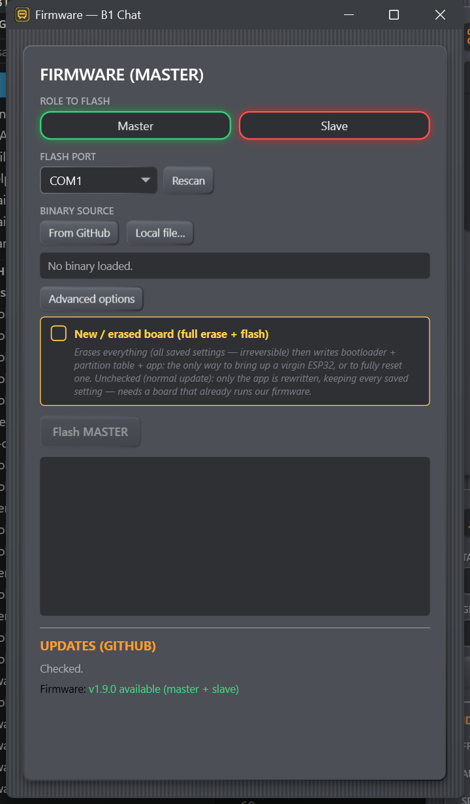

# Flashing Firmware over USB

*Figure: The complete Firmware window keeps role, USB source, flash log, and
GitHub update status in one place. The Flash Port is independent of the main
connection.*

USB flashing is the recovery path for a blank board, a master, or firmware that
cannot communicate. It can also perform routine app-only updates.

> **Before flashing:** identify the physical board and role twice. Keep power and
> USB stable. A wrong role can create a second master or remove the only master;
> a full erase permanently deletes that board's saved data.

## Choose the role

- Select **Master** for the one USB-connected coordinator in the fleet.
- Select **Slave** for every mesh member.

Only one active master should exist in a fleet. Role is part of the firmware
image, not a setting changed after boot.

## Choose the Flash Port

The Firmware window scans COM ports independently from the main connection and
can flash a board that has never completed a B1 handshake. If you select the
same port currently connected in the header, the console releases it for
`espflash` and reconnects afterward.

When several boards are connected, unplug/replug the intended one or use Device
Manager to confirm its COM number before continuing.

## Choose the binary source

### From GitHub

Downloads the newest release image for the selected role plus, when published,
the shared bootloader and partition table. Every downloaded firmware component
must match the release manifest's SHA-256 or the console rejects it. This is the
recommended path for normal users and blank boards.

### Local file…

Selects an arbitrary `.bin`, such as a local PlatformIO build. It is marked
**unverified**. If `bootloader.bin` and `partitions.bin` are beside the selected
file, the console makes full-flash mode available; it does not enable that mode
automatically.

Use local files only when you know the role, fleet group key, partition layout,
and origin of the build.

*Figure: Role, port, binary source, and erase mode are separate decisions.
Review each highlighted section before confirming a write.*

## App-only versus full erase + flash

### App-only — checkbox clear

Writes only the application at the configured address, normally `0x10000`.
Bootloader, partition table, and NVS are not rewritten, so local name,
calibration, and other persistent settings survive.

Use app-only for a board that already has the expected B1 bootloader/partition
layout and has **never switched its active boot partition through OTA**.

### New / erased board — checkbox selected

Erases the entire chip, then writes bootloader at `0x1000`, partition table at
`0x8000`, and application at `0x10000`. Support images must be available or the
console blocks the operation.

Use it for:

- a blank/new ESP32;
- deliberate factory recovery;
- a board that has completed any previous OTA update.

An OTA can switch which application partition boots. A later app-only USB write
to `0x10000` may succeed yet leave the board booting the older image from the
other partition. Full erase resets that state.

> **Permanent data loss:** full erase removes the board's name, servo calibration,
> animation parameters stored there, OTA state, and all other NVS data. Droids
> Backup does not include calibration. Record mechanical limits first.

Never rewrite a possibly different partition table without erasing the chip.
Moving the NVS region under existing data can expose stale settings or lose
recent ones without an obvious write error. The console intentionally couples
partition-table writing to full erase.

## Flash procedure

1. Close any serial monitor using the board.
2. Select role, Flash Port, and source.
3. Decide app-only versus full erase using the rules above.
4. Read the confirmation, especially the role, COM port, and erase state.
5. Choose **Flash MASTER** or **Flash SLAVE**.
6. Do not unplug the board until the log reports completion.
7. For the master, wait for automatic reconnection and verify the reported
   firmware version. For a slave, power it with the fleet and confirm its row.

Some ESP32 boards need manual bootloader entry. If the flasher cannot connect,
hold **BOOT**, start Flash, release BOOT once writing begins, and press **EN/RESET**
only if the board's manufacturer requires it.

## The visible flash log

Progress and `espflash` output appear in the dark log area. The current release
does **not** include a Save Log button. If a flash fails, take a screenshot of
the visible log before closing the window. The separate serial diagnostic trace
does not contain all redirected `espflash` output.

Continue with [Troubleshooting](../reference/troubleshooting.md) for connection,
boot-mode, or post-flash problems.
