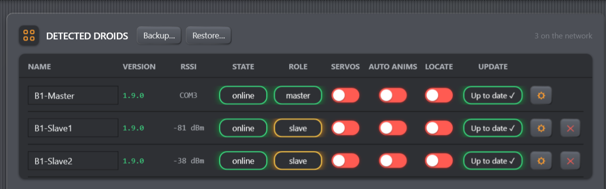

# OTA over the Mesh

OTA updates an adopted **slave** without connecting USB to that slave. The image
travels PC → master over serial, then master → target through ESP-NOW, including
relays when needed. The master itself is always updated over USB.

*Figure: OTA starts from the Update column of an adopted slave row. The master
row is updated through USB, never through mesh OTA.*

## Before starting

Confirm all of the following:

- the target row is the intended physical droid;
- the target is adopted, online, and has a stable path in Mesh Topology;
- the master is connected by USB and the PC will remain awake;
- both master and target have stable power;
- Internet access is available so the console can download and SHA-256-verify
  the latest slave image;
- no other OTA session is running anywhere in the fleet.

> **Do not power off, disconnect the master, close the console, or move the droid
> out of range during transfer.** One session can take 8–15 minutes on a good
> single-hop link and longer over a weak or multi-hop path.

## Start from the Droids row

Choose **Flash (OTA)** on the adopted slave and confirm. Only one fleet-wide OTA
session is allowed; another start is rejected rather than queued.

Progress is reported as acknowledged fragments out of the total, not a time
estimate. A temporary serial silence causes the console to retry the current
fragment. Repeated silence or a dropped serial link aborts the console session.

## Startup fleet update

When the startup release check finds older online droids, **Fleet Firmware
Update** offers one supervised batch. **Update all** processes adopted slaves
one at a time, displays acknowledged-chunk and overall progress, verifies the
reported version and official Build ID after every reboot, then updates the USB
master last. **Later** dismisses the offer for the current console session.

Offline/pending droids are omitted rather than blocking the batch. Newer
firmware and same-version local builds are never replaced automatically. The
batch uses app-only USB flashing for the master and never arms full erase. A
failure stops the remaining queue so the cause can be corrected before retrying.

## Transfer and reboot outcomes

After the last fragment, the slave verifies the image, finalizes it, and reboots.
The master waits up to roughly 90 seconds for a heartbeat and compares the
version seen before and after reboot:

- **Success** — the reported version and, for current releases, Build ID match
  the verified release image.
- **Rolled back** — the version did not change; the safety mechanism most likely
  restored the previous image.
- **Unreachable** — no heartbeat returned before the wait window expired. This
  does not prove whether the flash booted; restore power/range and inspect the
  row before retrying.
- **Transfer failed** — integrity, chunk, busy-session, serial, or mesh handling
  failed before a successful post-reboot result.

Do not start repeated blind retries. First confirm power, route, current version,
and the failure text.

## Anti-brick safety mechanism

Before booting a transferred image, the slave stores a pending flag. If the new
image repeatedly fails early boot, the board switches back to the other image
partition. A new image that runs for about 20 seconds is confirmed and clears
the pending flag.

Rollback greatly improves recoverability but cannot protect against every power,
hardware, partition, or bootloader failure. USB full recovery remains the final
path for a board that no longer reports.

## The next USB flash must be full

After even one successful OTA, assume the board may boot from the alternate app
partition. A later app-only USB flash can write successfully while the bootloader
continues starting the old partition. Select **New / erased board (full erase +
flash)** for that board's next USB flash. Read
[Flashing over USB](flashing.md) first because this deletes local calibration and
other NVS data.
