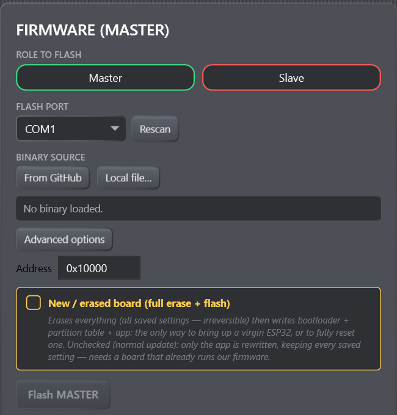

# Install & First Setup

This walkthrough starts with an unconfigured PC and one or more ESP32 boards.
If your fleet already runs and you only need to connect, use the connection
walkthrough in [Welcome to B1 Chat](getting-started.md).

## Before you begin

### PC requirements

- Windows 10 version 1607 (build 14393) or later on a 64-bit x64 PC.
- Windows 11 on ARM64 is supported through x64 emulation.
- No separate .NET installation is required; the installer includes the .NET 8
  desktop runtime and the `espflash` utility.
- Windows Media Foundation is optional for droid control, but required for
  reliable Sequencer audio playback and waveform previews.
- Internet access is needed only for GitHub update checks and downloads. Local
  files can be flashed without Internet access.

### Hardware checklist

- One DOIT ESP32 DevKit V1-compatible board per droid.
- One board designated as the only **master**; all others use slave firmware.
- A known-good USB **data** cable for the master and for initial USB flashing.
- Servos powered by a separate regulated 5 V supply/BEC sized for their current.
- ESP32 ground and servo-supply ground connected together.
- At least a 470 µF capacitor near the servo supply is recommended.

> **Hardware safety:** do not power the servos from the ESP32's regulator. Keep
> fingers, wiring, and mechanical stops clear whenever Servos is on. A stalled
> servo can draw high current and damage the mechanism or destabilize the board.

## Step 1 — Install the console

Run the B1 Chat Console installer. It performs a payload self-check and creates
Start menu and desktop shortcuts. The installer is per-user and normally does
not require administrator rights.

If the installer reports an unsupported Windows version, architecture, missing
Media Foundation, antivirus quarantine, or a failed payload check, follow the
message before connecting hardware. Media Foundation is the only optional item;
the other failures can prevent the application or USB flasher from working.

## Step 2 — Make the USB serial port appear

Connect one ESP32 with a data cable and open Windows **Device Manager → Ports
(COM & LPT)**. Boards may use different USB-to-serial chips, commonly CP210x or
CH34x. Windows Update often installs the appropriate driver automatically; if
no COM port appears, install the driver supplied by the board manufacturer.

Record the COM number. Unplug/replug the board if you need to distinguish it
from other serial devices.

## Step 3 — Flash the first master

1. Open the console and choose **Firmware…**.
2. Select **Master**. Only one board in a fleet should use this role.
3. Choose the board's **Flash Port**.
4. Choose **From GitHub** for the current verified release.
5. For a blank/new board, open **Advanced options**, then enable
   **New / erased board (full erase + flash)**.
6. Choose **Flash MASTER**, confirm, and do not disconnect power or USB.

*Figure: Confirm all four choices before enabling Flash. Full erase is intended
for a new board or a deliberate recovery, is kept under Advanced options, and
removes saved board data.*

A full flash erases all saved data on that board and writes the bootloader,
partition table, and application. See [Flashing over USB](firmware/flashing.md)
before using this option on an existing droid.

Current firmware treats a blank/full-erased board as uncommissioned: **Servos**,
**Auto anims**, and the transient **Locate** override all begin off. Servo PWM
remains detached, so startup does not briefly command center. These are virgin-
board defaults only; a normal firmware update preserves choices already stored
on an existing board.

## Step 4 — Flash every slave

Repeat the USB process for each remaining board, selecting **Slave**. A release
downloaded from GitHub uses the same fleet key for both roles. If you use local
custom builds, every master and slave must have the same compile-time group key
or they will deliberately ignore one another.

Label the physical boards while doing this. It is much easier to assemble and
calibrate a fleet when the intended role and droid are unambiguous.

## Step 5 — Connect the running master

After the prominent **FLASH COMPLETED** result appears, use **Close window**.
Choose the master's port in the main header and select **Connect**. On later
launches, the console tries the last connected port automatically. The green
status should include the firmware version and Build ID after the handshake.
The master itself appears in the Droids card.

*Figure: A successful connection shows a green status, the firmware version and
Build ID, the selected COM port, and a complete Disconnect button.*

If the port opens but the status remains at **handshake**, confirm that the
board has master firmware and no serial monitor owns the same port.

## Step 6 — Power and adopt slaves one at a time

Power one slave. Within a few seconds it should appear as **new** with Adopt and
Ignore buttons. Choose **Adopt**, edit its name, then enable **Locate** to verify
which physical head you are naming. Repeat for the remaining slaves.

*Figure: After adoption, every row identifies its role, reachability, firmware
state, motion toggles, and access to calibration.*

**Ignore is temporary.** It removes the current row but does not blacklist that
board, so an active slave can reappear on its next heartbeat and ask again.

## Step 7 — Calibrate safely

With the mechanism unobstructed, open calibration for one droid at a time:

1. Start with narrow min/max limits around center.
2. Set **Reverse** independently for PAN or TILT if its physical direction is
   opposite to the scene/preview direction.
3. Move toward each physical limit in small steps.
4. Stop before binding, buzzing, or excessive current draw.
5. Set the center to the desired neutral pose.
6. Wait at least 1.2 seconds after the last change before selecting another
   droid, then reselect it to confirm the stored values.

Continue with the full [Servo Calibration](calibration.md) guide.

## Step 8 — Test and save a baseline

Play a small gesture at modest amplitude, confirm every required mesh path, and
use **Backup…** in the Droids card to save names and animation parameters. The
backup does not include calibration, so keep a separate written record of
mechanical limits if rebuilding a droid would be difficult.

You are now ready for the [Animation](animation.md) and
[Sequencer](sequencer/timeline.md) workflows.
