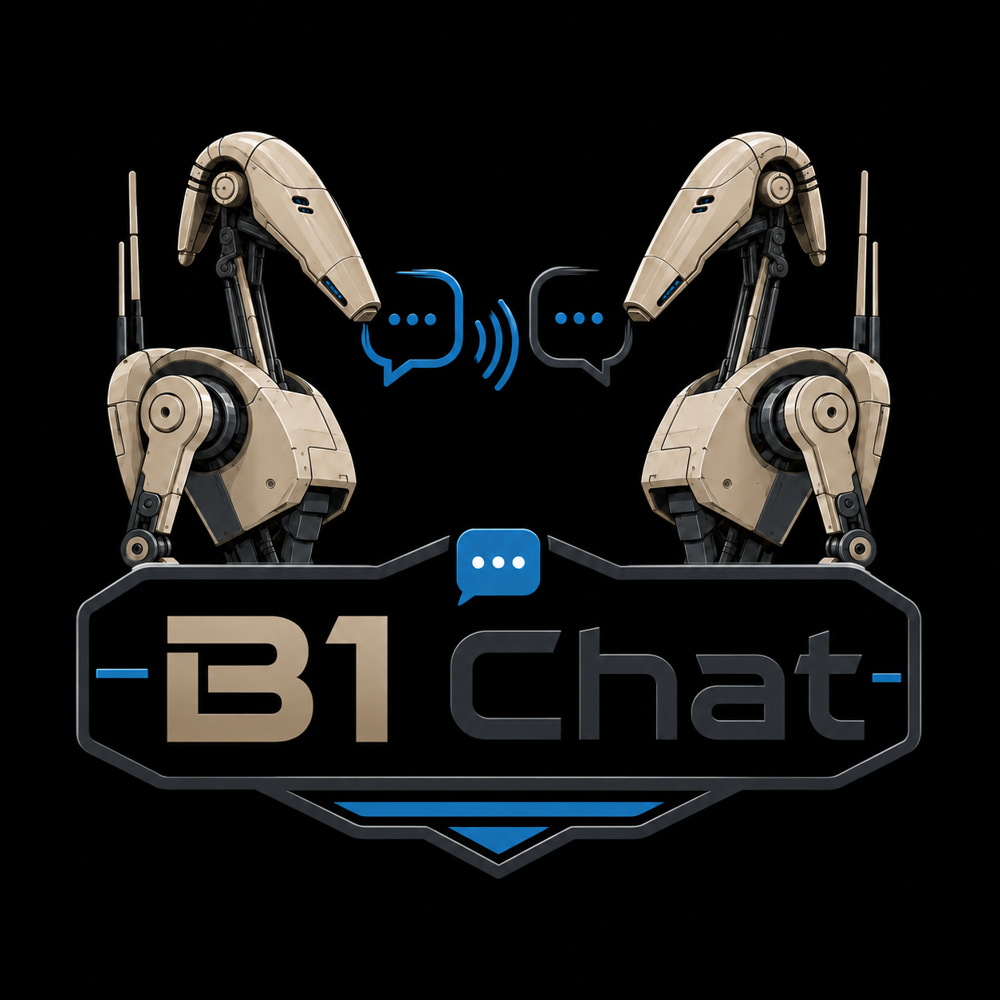

# Overview

**B1 Chat Console** is the supervision app for a B1 Battle Droid fleet: several
animated heads (pan/tilt servos) coordinated over a wireless mesh network by one
**master** board, which the console talks to over USB serial. There is no cloud
service and no companion phone app — everything happens over that one serial link.

## Connecting

1. Plug the master's USB cable in, pick its **Port** in the header (top-right,
   **Rescan** if it doesn't show up), and press **Connect**.
2. Once connected, the header's status dot turns green and the Droids card
   populates with everything the master can currently hear on the mesh.
3. The console **auto-reconnects**: if the cable is unplugged or the board
   resets, it keeps retrying every few seconds — no need to manually reconnect
   after a firmware flash or a power cycle.

## The cards

The main window is a grid of cards, each independently documented in this Help:

- **[Droids](droids.md)** — the fleet roster: names, adoption, per-droid toggles
  (Servos / Auto anims / Locate), backup & restore, firmware version and OTA.
- **[Servo Calibration](calibration.md)** — live pan/tilt preview and per-droid
  limits.
- **[Mesh Topology](mesh-topology.md)** — a radar-style view of the live radio
  network: which droid talks to which, signal strength, live traffic.
- **[Animation](animation.md)** — the 18 built-in gestures and the automatic idle
  behavior.
- **[Sequencer](sequencer/timeline.md)** — a multi-track timeline to choreograph
  several droids (and audio) together.
- **Firmware** — a separate window (the **Firmware…** button in the header) for
  [flashing over USB](firmware/flashing.md) and [OTA updates over the
  mesh](firmware/ota.md).

## Unsaved changes

Most settings (animation parameters, droid names) are edited live and
auto-committed to the master's persistent storage **2 seconds** after your last
change — watch for the small badge in the header: **● unsaved** while a change is
pending, **● synced** once it's written. There's no manual Save button for this;
just wait a couple of seconds after your last edit before power-cycling the
master.

Servo **calibration** and **sequences** are different: calibration is written
immediately by the targeted droid itself, and sequences live entirely on your PC
(see [Sequencer → Playback](sequencer/playback.md)) — neither depends on the
auto-commit badge above.

> **Tip:** most controls have a tooltip — hover over a button to see what it does.
