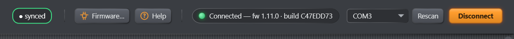
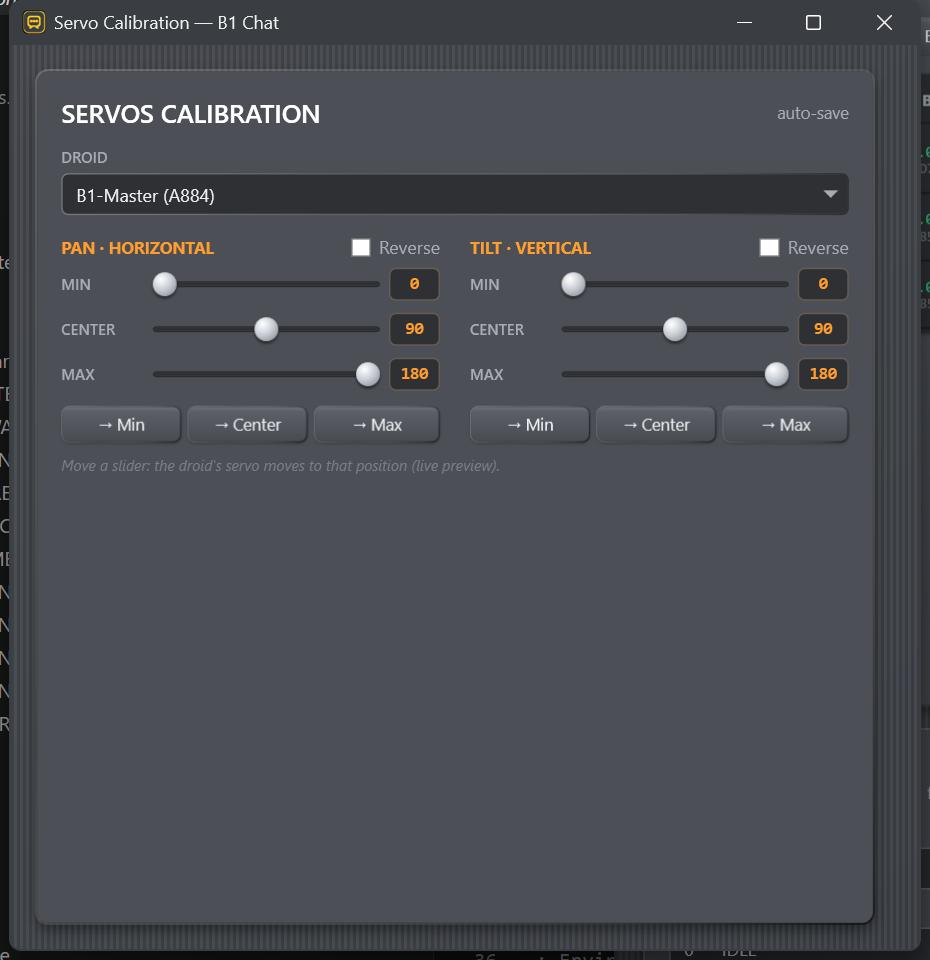

# Welcome to B1 Chat

**B1 Chat Console** controls a fleet of animated B1 Battle Droid heads. Each
head has its own ESP32 and pan/tilt servos. One board is the **master**; the
console talks to that master over one USB serial connection, and the master
reaches the other droids through the ESP-NOW mesh.

There is no cloud control service and no phone app. Internet access is used
only to check GitHub for console and firmware releases. Normal control,
calibration, sequencing, and local audio stay on your PC and local mesh.

> **New installation?** Start with [Install & First Setup](first-setup.md).
> It covers Windows requirements, hardware power, the first master/slave flash,
> connection, adoption, and safe calibration in the right order.

This guide describes **B1 Chat Console 0.12.0** with **firmware 1.11.0,
protocol 5**. Use matching current console and firmware releases whenever
possible; older firmware may omit controls that depend on newer capabilities.

## The three-minute tour

### 1. Connect the master

*Figure: Select the master's COM port and Connect. Once connected, the button
changes to Disconnect and the green status includes the firmware version.*

1. Power the master and connect it to the PC with a **USB data cable**.
2. Pick its **Port** in the top-right list. Choose **Rescan** if it is missing.
3. Select **Connect**. A successful connection changes the status to green and
   shows the master's firmware version.
4. If the board resets or its cable is briefly unplugged, leave the console
   open: it retries the same port every 3 seconds. Choosing **Disconnect** stops
   automatic reconnection.

If no port appears, go directly to [Troubleshooting](reference/troubleshooting.md).

### 2. Identify the fleet

*Figure: The roster answers “what is online?” while the radar answers “how is
it reachable?” This example shows one master and two slaves.*

New slaves appear with **Adopt** and **Ignore**. Adopt the boards that belong to
this fleet, rename them, and use **Locate** to match a row with a physical head.
Then check that every required droid has a path back to the master in Mesh
Topology.

### 3. Calibrate before playing gestures

Open the gear button on a droid row or use the Servo Calibration card. Set
conservative min/center/max values before using large-amplitude gestures. Keep
hands and loose parts clear while previewing motion. See
[Servo Calibration](calibration.md) for the safety checklist and save timing.

*Figure: Always confirm the droid name at the top before moving a calibration
slider; slider movement previews live on that droid.*

### 4. Try one gesture, then build a sequence

Use the Animation card for a single test gesture. Once every droid moves safely,
use the [Sequencer](sequencer/timeline.md) to place gesture and audio clips on a
shared timeline. Playback is driven by the console, so the PC and serial link
must remain active.

## What each card does

- **[Droids](droids.md)** — adoption, identity, live state, per-droid toggles,
  configuration backup/restore, versions, and OTA entry points.
- **[Servo Calibration](calibration.md)** — safe pan/tilt limits, neutral centers,
  and live position preview.
- **[Mesh Topology](mesh-topology.md)** — direct radio neighbors, relayed paths,
  signal strength, and observed traffic.
- **[Animation](animation.md)** — manual playback of the 18 built-in gestures and
  per-droid idle tuning.
- **[Sequencer](sequencer/timeline.md)** — multi-droid gesture tracks, local audio,
  editing, playback, and `.b1seq.json` import/export.
- **Firmware** — [USB recovery and flashing](firmware/flashing.md),
  [slave OTA](firmware/ota.md), and [console updates](firmware/console-updates.md).

## Know where your changes are saved

Names and animation parameters first update a working copy on the master. The
console commits that copy about 2 seconds after the master reports it dirty.
Animation sliders also have a 1.2-second input debounce, so the full trip from
your last slider movement to **synced** can take a little over 3 seconds. Watch
the header badge and wait for **● synced** before power-cycling the master.

Calibration follows a different path: after 1.2 seconds without another slider
change, the console sends all six values to the selected droid, which stores
them immediately. There is currently no calibration saved indicator; changing
targets before the 1.2-second delay cancels that pending change.

Scenes and their audio layout live on the PC. Timeline edits are **not
autosaved**. Save the Scene to the Local Library before closing the console or
making risky edits. Export a `.b1seq.json` copy when you need backup or transfer,
and keep the referenced audio files in place. See
[Data & Backups](reference/data-and-backups.md) for the exact boundaries.

## A useful rule of thumb

If the action moves hardware, flashes firmware, or changes calibration, first
verify the target name, its physical identity, its power, and its network state.
The console deliberately does not queue missed commands for an offline droid.

> **Tip:** most controls have a tooltip. Hover when you are unsure, and use the
> Help sidebar to follow the task you are performing rather than reading every
> page front to back.
