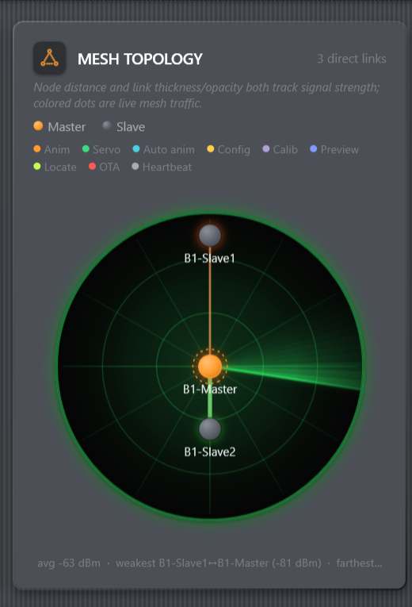

# Reading the Mesh Radar

The Mesh Topology card visualizes the network information that the master makes
available over serial. Use it to answer two questions: **can the master reach
this droid, and through which neighbors?**

*Figure: The master stays at center. Node radius and link appearance reflect
reported signal strength; colored traffic marks appear while commands move.*

## Nodes

- The master is pinned at the center.
- Slaves keep a stable bearing derived from their ID, making the display easier
  to learn across sessions.
- Radius follows signal strength: a stronger path draws a node closer to center;
  a weak path moves it toward the rim.
- A known droid with no current path sits at the rim.
- Movement is smoothed so normal RSSI jitter does not make the display twitch.

RSSI is reported in dBm. Values closer to zero are stronger; for example,
`-45 dBm` is much stronger than `-85 dBm`. Treat it as a relative diagnostic,
not an exact distance measurement: antennas, orientation, people, power noise,
and nearby 2.4 GHz traffic all affect it.

## Links and relays

Lines represent direct radio-neighbor observations periodically reported by the
droids. A multi-hop slave can remain reachable even when its direct link to the
master disappears, provided another droid relays the traffic. Link thickness and
opacity encode strength.

Neighbor reports update on a roughly three-second cadence with jitter, so the
picture intentionally lags a physical move slightly. If testing relay behavior,
move one droid, wait several seconds, and watch which direct edge disappears or
replaces it.

## Live traffic dots

Colored dots show observable activity:

- outgoing gesture, servo, calibration, preview, and Locate
  commands;
- acknowledged OTA fragments;
- a generic inbound heartbeat/neighbor-report indication.

This is not a packet capture. The console cannot show every inter-slave relay
frame that the master never surfaces over serial, and one visible housekeeping
dot may stand in for periodic traffic rather than one exact radio packet.

## Troubleshooting with the radar

1. Confirm the droid exists in the Droids roster.
2. Look for any path to the center, not only a direct master edge.
3. If the node is at the rim, check power and nearby relay droids.
4. Rotate or separate boards and power wiring; antenna orientation matters.
5. Wait at least one report interval before judging the change.

Commands sent while no route exists are not queued. Once the path returns,
repeat the command or calibration action.
