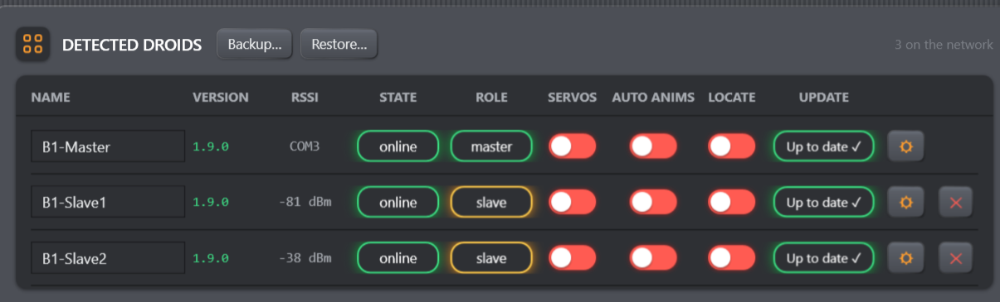

# Data, Backups & Moving to Another PC

B1 Chat stores different information in different places. No single button is a
complete fleet backup.

## Storage map

| Information | Stored where | Survives app-only flash? | Included in Droids Backup? |
| --- | --- | --- | --- |
| Droid name | Target droid NVS plus master cache | Yes | Yes |
| Frequency/amplitude/speed | Target droid NVS plus master configuration | Yes | Yes, when known to the console |
| Servo calibration | Target droid NVS | Yes | **No** |
| Adoption | Master NVS | Yes on the master | **No** |
| Servos / Auto anims / Locate state | Runtime/transient behavior | Do not rely on it | No |
| Sequence gesture/audio layout | PC memory and exported `.b1seq.json` | Not applicable | No |
| Actual audio bytes | Original files on the PC | Not applicable | No |
| Last COM port and last sequence path | PC `settings.json` | Not applicable | No |

A full erase destroys all NVS on the board being flashed. An app-only flash is
designed to leave NVS untouched when the board already has the expected
partition layout.

## Droids Backup

Use **Backup…** to export names and known per-droid animation parameters. Use
**Restore…** to write those supported fields back. Large restores can be split
into multiple validated batches, and older firmware may apply individual
commands, so verify the final fleet instead of assuming one global transaction.

*Figure: Backup and Restore apply to supported roster data. They are not a
substitute for sequence exports, copied audio files, or a calibration record.*

Calibration, adoption, toggle state, sequences, and sound files require separate
protection.

## Sequence export

Export writes a `.b1seq.json` snapshot containing gesture clips, target IDs,
offline track layout, audio-lane layout, and **paths** to audio files. It does
not embed or copy audio. Timeline edits after the export remain only in memory
until the next export.

Export writes and flushes a sibling temporary file before atomically replacing
the destination. A failed write or replacement preserves the previous file and
does not move the editor's saved checkpoint. A successful Export, Import, or
Local Library Load establishes the clean checkpoint used by the Dirty indicator;
Undo/Redo compares the actual document with that checkpoint.

For another PC, copy both the sequence JSON and every audio file. Import the JSON,
then use Replace file on any clip whose old absolute path is invalid.

Sequence Import validates the complete document before replacing the editor.
Versions 1–4 are supported and migrated explicitly; unknown future versions and
invalid fields are refused with a field-specific error, leaving the open
sequence unchanged. Very old DFPlayer track numbers do not contain PC file paths
and therefore cannot restore their original sound automatically.

## Console-local files

The following directory is used under the signed-in Windows account:

`%LOCALAPPDATA%\B1ChatConsole`

- `settings.json` — last selected COM port and last imported/exported sequence
  path.
- `serial-trace.log` — recreated at every launch; copy it before relaunching if
  it contains a problem report.
- `library\` — legacy/local-library JSON entries shown by Load/Delete. The
  current UI cannot create new entries here.
- `updates\` — downloaded console installers and verified firmware assets.

Do not hand-edit these files while the console is running. Normal sequence
portability should use Export/Import rather than copying `settings.json`.

## Before changing PCs or performing a full erase

1. Export a fresh Droids Backup.
2. Export every sequence you need.
3. Copy the audio assets used by those sequences.
4. Record every droid's six calibration values separately.
5. Record which board is master and which boards have previously used OTA.
6. Keep the release/version information with the backup set.

After restoration, verify names, calibration, a small gesture, audio output, and
mesh reachability before running a full sequence.
