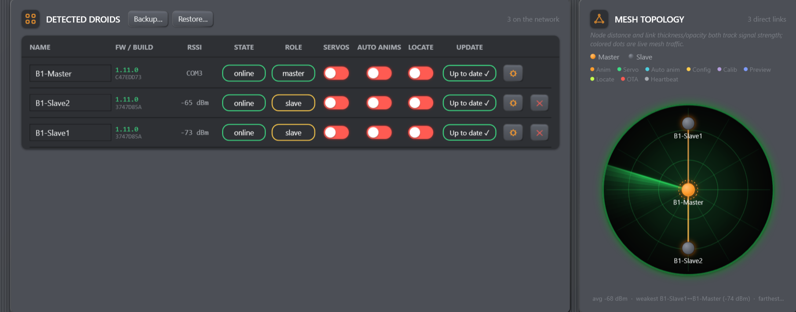

# Glossary

*Figure: The left card shows roster terms and roles; the right card shows the
same fleet as mesh nodes and direct links.*

## Roles and identity

**Master** — the single ESP32 that connects to the console over USB and
coordinates/bridges the mesh. A fleet should have only one.

**Slave** — a droid ESP32 controlled through the mesh. An adopted slave can be
updated by OTA.

**Droid ID** — a 16-bit identity derived from the board's MAC address. It lets a
saved sequence recover the correct track even when the droid is offline.

**Group key / fleet key** — compile-time key shared by boards in one fleet.
Frames signed with another key are rejected. It is not editable in the console.

## Roster states

**Adopted** — accepted into the master's persistent roster.

**Pending / new** — heard on the mesh but not adopted. Adopt and Ignore replace
the normal row controls.

**Ignore** — removes the current pending row only. It is not a permanent block.

**Forget** — removes an adopted slave and clears its adoption status. An active
board can return as new.

**Lost** — retained in the roster but silent for at least 4 seconds. It becomes
online automatically when a heartbeat returns.

## Mesh terms

**ESP-NOW** — the local 2.4 GHz radio transport used between boards.

**Direct link** — one droid reports hearing another directly over radio.

**Relay / multi-hop** — another droid forwards a frame so the target need not be
in direct range of the master.

**RSSI** — received signal strength in dBm. Closer to zero means stronger.

**Heartbeat** — periodic status message carrying presence, runtime state, and
firmware version.

## Storage and updates

**NVS** — nonvolatile storage inside an ESP32. Names, calibration, animation
parameters, adoption, and OTA guard state use it according to the board's role.

**Dirty / synced** — the master's name/animation working configuration has or
has not been committed to persistent storage. It does not report calibration or
sequence save state.

**Build ID** — deterministic eight-character identity derived from the firmware
source, PlatformIO configuration, and role. It distinguishes two binaries that
carry the same human-readable firmware version and lets an update verify the
exact image that rebooted.

**OTA** — over-the-air slave firmware transfer through the master and mesh.

**App-only flash** — writes the application image without erasing bootloader,
partition table, or NVS. It is not the safe USB follow-up after a board has used
OTA.

**Full erase + flash** — erases the chip and rewrites bootloader, partition table,
and application. It permanently deletes that board's NVS.

**Rollback** — the OTA guard returns to the previous image after the new image
fails early boot or does not report a changed version.

**Fleet update** — supervised console workflow that offers semantic upgrades to
eligible online adopted droids, updates slaves sequentially by OTA, and flashes
the USB master app-only last. It never chooses full erase automatically.

## Sequencer terms

**Track** — a gesture lane targeted to one droid or the All droids broadcast ID.

**Audio lane** — a PC-only row holding one or more linked sound files.

**Armed track** — destination for a gesture-library chip that is clicked rather
than dragged.

**Snap** — optional rounding of placement to 100 ms when a clip is inserted or
released.

**Console-driven playback** — the PC schedules and sends individual commands in
real time. No standalone sequence remains on the master.
