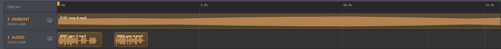

# Sequencer — Audio

All sequence audio plays through the PC. Droids have no onboard audio player,
and no audio data crosses the serial link or mesh.

*Figure: Audio lanes are PC-only. The long ambient clip and shorter waveform
clips can overlap because each file keeps its own start time.*

## Requirements and formats

The file picker offers `.mp3`, `.wav`, `.wma`, and `.ogg`. Actual decoding and
playback depend on Windows Media Foundation and installed codecs. A waveform can
fail to render even when the rest of the console continues working.

Use unprotected, locally stored files for the most reliable show setup. Test the
exact PC, output device, volume, and files before a performance.

## When a file cannot be read

A clip whose duration cannot be read — missing file, missing codec, unreadable
stream — is still added to the timeline. It keeps a minimum width so you can
select and replace it, and it carries a **⚠ badge with an orange border**; the
tooltip states the reason. Such a clip counts as zero length, so it never silently
changes where the sequence ends.

If a clip fails during playback, the Sequencer names the file and the reason
instead of failing silently, and the rest of the pass continues.

## Add and arrange audio

- Choose **+ Add audio lane** for another named row.
- Use the small **+** on a lane to add a file at the current playhead.
- Drag a clip horizontally to change its time.
- Drag vertically to move it to another audio lane.
- Clips may overlap and play concurrently, even in the same lane.
- Right-click a clip for **Replace file…**, **Loop**, or **Delete**.
- Click the lane name in the gutter to edit it directly. Right-clicking the lane
  offers Delete; it does not provide a separate Rename command.
- Deleting a nonempty lane asks before deleting all of its clips.

Audio lanes currently have no mute switch. Droid-track mute controls affect only
gesture commands.

## Looping an audio clip

A clip marked Loop restarts while sequence playback continues beyond that file's
natural end. Sequence duration is calculated from the natural ends of gesture
and audio clips, so a looping audio file needs some later/longer timeline content
if you expect to hear it repeat before the pass ends. Whole-sequence Loop is a
separate transport option that restarts the complete pass.

## Pause and resume

Pause retains the position of audio that is already playing. Resume continues
that audio and schedules future clips; a clip that already finished before the
Pause is not restarted. Stop closes all active players. Pressing Play during an
active pass first stops existing audio to avoid stacking duplicate players.

## Files are linked, not embedded

The sequence stores only each file's full local path, duration, timing, and Loop
flag. Moving, renaming, disconnecting, or deleting a sound file breaks that clip.
Exporting a sequence does not copy the sound file.

For a portable show folder:

1. Put the `.b1seq.json` and all audio assets in a stable folder before editing.
2. Do not move that folder after choosing the files.
3. On another PC, import the sequence and use **Replace file…** on broken clips
   to point them at the copied assets.

See [Troubleshooting](../reference/troubleshooting.md) if audio is silent or a
waveform is missing.
