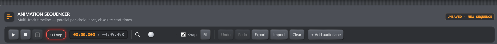
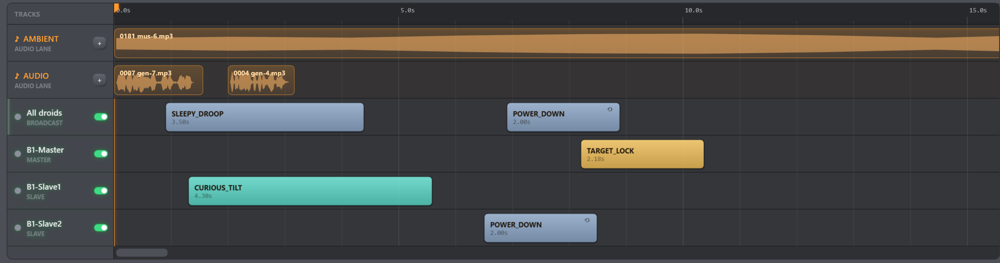

# Sequencer — Playback & Saving

*Figure: Playback is controlled from the left; Snap, Fit, Undo/Redo, Clear, and
audio-lane creation follow in the same toolbar. Scene file actions now live in
the document bar above the timeline.*

## What Play actually does

Play captures an immutable plan and gives its ordered batches to one rearmable
console scheduler. The number of clips does not increase the number of Windows
timers. At each monotonic deadline, the scheduler drains every due batch, sends
the real gesture commands through the master, and starts local audio on the PC.
If Windows wakes it late, all overdue batches are caught up in their original
order before the next deadline is armed. Keep the console running, the master
connected, and the PC awake for the entire performance.

This is practical choreography, not sample-accurate show control. Windows timer
scheduling, serial delivery, ESP-NOW relays, weak links, and commands sharing the
same start time can introduce small offsets. Events at the same timestamp form
one batch: gesture clips are sent in editor order, followed by audio clips in
lane/clip order. They are serialized, not latched by every droid on one hardware
clock edge.

Two gestures for the same target at one timestamp are both sent in editor order;
the last command received by that droid wins. Mixing broadcast and targeted
gestures at one timestamp is also ambiguous because mesh arrival can differ from
console send order. The **SCHEDULE** warning appears after Play; hover it for the
exact timestamp and conflict description. Separate those clips in time when the
final physical pose matters.

## Preflight before Play

Choose **Preflight** to open the readiness panel. Each finding names the affected
connection, droid track, gesture, audio lane/file and timestamp. **Go to** moves
the stopped playhead to that finding and selects its gesture when applicable.

- `ERROR` blocks a new Play or Restart and opens the panel automatically.
- `WARNING` is visible but does not block playback.
- `INFO` confirms a ready or deliberately audio-only Scene.

The scan checks the serial port and handshake only when active gesture clips need
droids. It then checks for an online master, offline targeted droids, broadcasts
with no recipients, missing/unreadable audio, pending or unknown audio duration,
and `TALK`/`POWER_DOWN` clips without a valid represented endpoint. Muted gesture
tracks are ignored; an audio-only Scene is allowed without a master. The scan
does not send commands, alter the Scene, probe media or change Windows settings.
Play, Restart and Resume refresh it against the current environment. Muting an
offline target is the explicit rehearsal choice to run without that droid;
missed commands are never queued or replayed after reconnection.

*Figure: The orange playhead crosses linked audio and per-droid gesture lanes.
Muted or offline rows do not create a queue for missed commands.*

## Play, Pause, Stop, and Loop

- **Play** (`Space`) starts from the current playhead. At the natural end it
  starts a new pass from t = 0. Prior gesture events are skipped because their
  droid state cannot be reconstructed safely. An audio clip that overlaps the
  cursor instead seeks to its matching source offset; a looping clip seeks to
  the corresponding point in its current cycle.
- The same primary button becomes **Pause** while running and **Resume** while
  paused. A rapid second press therefore pauses; it never silently restarts the
  Scene.
- **Restart** (`Ctrl+Enter`) is the explicit from-zero action. It cleans up the
  current pass before scheduling a fresh one.
- **Pause** freezes the console playhead, pauses active PC audio, and cancels
  future scheduled sends. It sends no pause/stop command to the droids: every
  finite gesture already received continues to its natural completion, and a
  running `TALK`/`POWER_DOWN` continues while its safety lease is renewed.
  Moving the timeline playhead while paused abandons that retained pass through
  normal Stop cleanup and changes the transport to Stopped at the new position;
  clicking without moving preserves ordinary Resume.
- **Stop** cancels future sends, stops local audio, sends targeted `IDLE` cleanup
  to droids whose latest Sequencer gesture is `TALK` or `POWER_DOWN`, and retains
  the playhead for inspection. **Return to start** (`Ctrl+Home`) is a separate
  navigation action available after stopping.
- **Safe Stop** cancels the same console work, then tells every reachable droid
  to interrupt its current gesture, move to calibrated center, retain servo
  holding torque, and suppress automatic animation until a later explicit
  gesture is sent. It also retains the last playhead position diagnostically.
- **E-STOP** cancels the show and persistently disables servo outputs on every
  reachable droid immediately. It has no confirmation dialog. With no holding
  torque, unsupported mechanics may fall; re-enable Servos deliberately from
  the Droids card after inspecting the hardware. It retains the last playhead
  position diagnostically.
- The cyan dashed **END** line is the authoritative Scene endpoint. **END AUTO**
  follows the calculated content tail. Move the stopped playhead and choose
  **Set End** to extend the Scene; **Auto** returns to the calculated tail.
  Existing content is never truncated, and endpoint edits support Undo/Redo.
- **Loop** starts a new pass when the Scene endpoint is reached. A
  `POWER_DOWN`/`TALK` clip first reaches its authored endpoint and sends IDLE;
  the next pass then starts cleanly at t = 0. Without Loop, natural completion
  stops at the calculated end so the finished position remains visible.

Persistent timeline editing is locked during both Play and Pause. Press
**Stop** before inserting, moving, duplicating, deleting, using the inspector,
changing Loop or audio lanes, Undo/Redo, Clear, Save, Save As, or Trash. The
disabled controls, their tooltips, and the **EDIT LOCKED** badge expose that
policy. **New**, **Open**, and **Import** remain available: after a destination
is chosen, they explicitly ask before stopping playback and replacing the
document.

Selection and inspection, track arming, dynamic droid-track mute, zoom, Snap,
Fit, scrolling, and Export remain available because they do not alter the
document being performed. This keeps the visible sequence content identical to
the immutable pass while preserving useful monitoring and snapshot tools.

An unexpected serial disconnect stops the active pass and its local audio rather
than silently continuing a partial audio-only performance. Closing the console
does the same cleanup. A deliberate audio-only Dry Run mode is a future feature,
not an automatic fallback for a lost master.

> **Important:** Pause cannot freeze or retract a gesture already sent to a
> droid, and Stop does not interrupt finite one-shot gestures. A one-shot gesture
> finishes naturally. For a tracked looping `POWER_DOWN` or `TALK`, Stop,
> non-looping natural end, application shutdown, or restarting Play sends a
> targeted `IDLE` to each affected droid without disturbing other targets.

While paused, the transport displays **PAUSED · DROID MOTION CONTINUES**. Target
execution reports still update the clips, so a finite gesture may change from
`START` to `DONE` while the PC playhead remains frozen. Pressing Play resumes
only local audio and timeline events that were not already dispatched; it does
not resend or restart a gesture that continued during Pause.

The console remembers the latest Sequencer gesture written for each concrete
droid. Broadcast looping gestures are expanded to the droids online at dispatch;
a later per-droid finite gesture removes only that droid from cleanup. Repeated
Stop is idempotent after a successful serial write. If the link is unavailable,
cleanup remains retryable. Current firmware also gives Sequencer-started
`TALK`/`POWER_DOWN` a five-second safety lease, renewed every two seconds while
the pass still owns the gesture. If the console crashes, the cable is removed,
the master becomes unreachable, or renewal otherwise stops, the target returns
to `IDLE` automatically. Pause keeps renewing until the authored clip endpoint;
that endpoint or explicit Stop cancels renewal before sending IDLE. Delayed
renewal from an older pass cannot extend a newer gesture.

This lease applies only to Sequencer playback. A looping gesture started from
the Animation card remains a direct operator command and runs until another
gesture is sent. Autonomous idle animations are also outside the lease policy.
With older firmware that does not advertise `animLease`, the Sequencer retains
targeted Stop cleanup but cannot provide the crash/link-loss fallback.

Safe Stop requires firmware advertising `safeStop`. With older firmware the
console sends broadcast `IDLE` as a best-effort fallback, but automatic movement
may resume afterward. Emergency Stop uses the older fleet Servo OFF command and
therefore remains available across that compatibility boundary.

Each gesture clip shows non-blocking delivery and execution feedback. `WRITE`
means Windows accepted the write to the serial port. `MASTER` means the master
parsed, validated, and dispatched that correlated command. `START`/`ACK n/N`
means one or more software animation engines started it, and `DONE`, `STOP`, or
`REJECT` reports the final result. `NO LINK`, `NOT READY`, or `WRITE FAIL`
appears immediately when the command cannot leave the console; no execution
timeout is armed for such a command. `MESH FAIL` means the master accepted the
command but its radio stack could not queue a frame needed by the selected
remote/broadcast target. If no start report arrives within 1.5 seconds, the
clip changes to
`UNCONF` (or `MISS n/N` for a broadcast). A finite gesture that started but did
not report completion by its expected duration plus 1.5 seconds changes to
`TIMEOUT`. These are warnings: they never pause the timeline. A delayed valid
report updates the clip again. Hover over the clip for per-droid details.

Older firmware without the additive `animAccepted` event can move directly from
`WRITE` to a target execution state. ESP-NOW's `meshQueued` indication only says
the radio stack accepted the outgoing frame; it is not proof that a slave
received it. Target execution remains the success signal.

`POWER_DOWN` and `TALK` loop while their Sequencer lease is renewed, so their
healthy state remains `START`; they become terminal when another gesture
interrupts them, the firmware rejects the command, or the lease expires
(`STOP`, reason `leaseExpired`). Execution feedback confirms the firmware
animation engine, not physical servo motion.

A muted droid track is skipped when its scheduled start arrives. If the command
was already sent before you mute or pause, the target continues it.

## Offline droids and missed events

An offline track is retained for layout, but it does not create an offline work
queue. A droid that reconnects halfway through a performance does not receive
earlier clips retroactively. Stop, restore connectivity, and restart the pass if
those events matter.

## No standalone onboard playback

Firmware versions before 1.7.0 had eight master sequence slots and could run
without a PC. Those slots and that player no longer exist. Current playback
always needs the console and active serial connection.

## Export and Import

**Export** atomically writes a `.b1seq.json` snapshot containing:

- sequence name and whole-sequence Loop setting;
- automatic or user-set Scene endpoint;
- gesture clips, target IDs, and explicit `POWER_DOWN`/`TALK` endpoints;
- saved droid track names/order for offline layout;
- audio lane names, clip timing, Loop flags, and local file paths.

The sound bytes are not embedded. Copy the audio files separately and expect to
repair paths when moving a sequence to another PC.

The console first writes and flushes a temporary file beside the destination,
then replaces the destination in one rename. A denied path, full disk, or failed
replacement leaves the previous file and the editor's saved state unchanged.
For a new or imported document, a successful export becomes its external-file
checkpoint: its Dirty indication clears, but Undo history remains available.
For a Local Library Scene, Export is only an external copy: it neither updates
that Scene nor clears a modified indication. Use Save for that. Choosing a
different filename never silently renames the Scene inside the document.

**Import** loads the snapshot and records that file as the last sequence path.
The console tries to reload that same file on its next launch. Later edits are
still in memory only: they do not update the file until you Export again or save
the document as a Local Library Scene. Import never silently adds a Scene to the
library.

Before replacing the editor, Import reads and validates the entire file. It
accepts sequence schema versions 1 through 6 and migrates their historical
timing/audio/track layouts. Versions 1–4 give legacy looping gestures a real 2 s
endpoint matching their former displayed width. Version 1 relative gesture
delays are converted cumulatively so their original order and timing are preserved. A file
with the wrong type, a future version, invalid targets/animations/timing, unsafe
counts, or malformed sections is rejected without changing the open sequence,
selection, or Undo history. The error identifies the offending JSON field.

If the open sequence is modified, Import offers **save and continue**,
**continue without saving**, or **cancel**. Cancel preserves the document and
last sequence path. A successful Import becomes the new saved checkpoint and
starts with empty Undo/Redo history.

Legacy numeric DFPlayer `audioTrack` values cannot identify a sound file on the
PC and are not imported as audio clips. Add or replace the corresponding audio
file manually after importing an old version 1 or 2 document.

Schema version 6 stores `endMs`: `null` selects automatic content-tail mode and
an integer stores the user-set Scene endpoint. Versions 1–5 migrate to automatic
mode.

## Scene names and the Local Library

The current Sequencer document is a **Scene**. Its document bar provides
**New**, **Open**, **Save**, and a **…** menu. Edit its name directly or choose
**Rename** (`F2`). **Save** (`Ctrl+S`) updates the open Local Library Scene, or
creates a new stable Scene identity for a new/imported document. **Save As**
(`Ctrl+Shift+S`) always asks for a name and creates a separate identity. Names
are unique without regard to case; a conflict is reported and never overwrites
a different Scene.

**Open** (`Ctrl+O`) displays the searchable Scene browser instead of exposing
storage rows below the timeline. A click selects; a double-click or **Open**
loads the Scene; the current Scene carries an OPEN badge. The browser also
offers **New Scene**. A modified document offers save-and-open, open without
saving, or cancel. Active playback asks to stop before replacement. A
successful Open establishes a clean checkpoint and the console restores that
Scene on its next launch. Cancel leaves content, playback and history intact.

**Move current Scene to Trash** is deliberately kept in the **…** menu. It
identifies the exact Scene and asks before moving its versioned JSON entry to
`library\trash`. The file remains recoverable manually. If the Scene
being edited is trashed, its content stays open as a modified new document so it
can be saved again. Valid historical library JSON is migrated automatically;
unreadable files remain untouched and are counted in the Local Library status.

## Clear and recovery

**Clear** removes every gesture and audio clip but keeps the audio lanes and
current sequence name. It asks before clearing when the editor reports changes,
and the clear itself can be undone immediately. Undo history is memory-only; an
application restart cannot recover edits that were neither saved nor exported.
