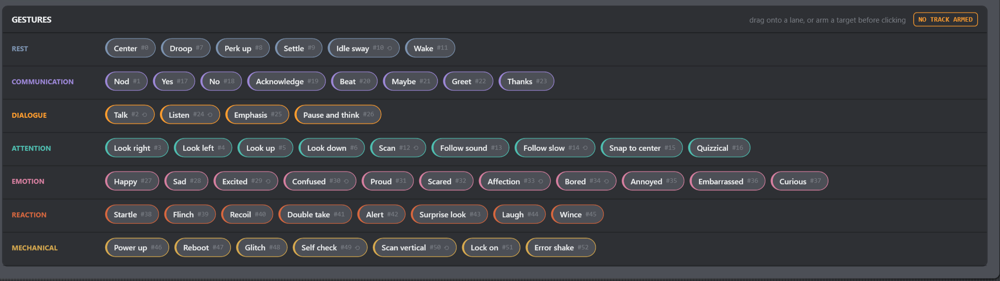

# Sequencer — Build a Timeline

The Sequencer coordinates gesture commands and PC audio on one shared clock. It
is entirely console-driven: no sequence is uploaded to a droid or master slot.

*Figure: The current toolbar separates Play/Pause, Restart, Stop, return to
start, Safe Stop and E-STOP, followed by the endpoint, Preflight, navigation and
editing controls. Scene file actions remain in the document bar above it.*

*The Scene document bar and transport/editing toolbar keep timecode, endpoint,
Preflight, zoom, Snap, import/export, Clear, and audio-lane controls together
above the timeline.*

## A first sequence in six steps

1. Connect the master so live droids populate their tracks.
2. Click a track gutter to **arm** it. The highlighted track receives gesture
   chips that you click. Fresh startup deliberately has no armed target.
3. Click the ruler to place the playhead at the desired time.
4. Click a gesture in the bottom library, or drag it directly onto a track and
   time.
5. Optionally choose **Preflight** to inspect potential Scene-content problems.
   Its findings are advisory and never prevent playback.
6. Give the Scene a name, choose **Save** (`Ctrl+S`) to keep it in the Local
   Library, then use **Export a copy** from the **…** menu only when you need an
   external file.

## Tracks

*Figure: Audio lanes sit above the broadcast, master, and slave gesture tracks.
Every visible clip is contained completely inside the capture.*

*This real sequence contains two audio lanes plus broadcast and per-droid
gesture lanes. Saved droids that are absent would remain here as OFFLINE.*

- **All droids** is a broadcast track. One clip sends one fleet-wide command.
- Each known droid receives its own track with its name and role.
- A droid saved in a file but currently absent remains as **OFFLINE**, preserving
  the arrangement until it reconnects.
- Clicking a gutter explicitly arms that track for gesture-library clicks. The
  orange **ARMED · target** badge above the library always names it. With no
  armed target, clicks do nothing rather than silently falling back to
  **All droids**; direct drag-and-drop remains target-explicit.
- The green switch mutes a droid track during console Play. It does not edit the
  sequence file and cannot retract a gesture already sent to the mesh.
- Audio lanes are not controlled by these droid mute switches.

## Ruler, zoom, and Snap

The ruler shows time; click or drag it to move the local playhead while playback
is stopped or paused. The zoom control ranges from 20 to 300 pixels per second.
**Fit** zooms the whole sequence into view and returns horizontal scroll to the
start. `Ctrl+mouse wheel` zooms multiplicatively around the time beneath the
pointer; `Shift+mouse wheel` pans horizontally, while an unmodified wheel keeps
its normal WPF behavior.

**Follow** keeps a running playhead inside a comfort corridor instead of pinning
it permanently to the center. A new Play or Restart enables Follow. Dragging the
horizontal scrollbar suspends it while held, then releasing the scrollbar
automatically catches up. Fit, slider zoom, pointer zoom, or Shift-wheel panning
turns it off for deliberate inspection; click Follow to catch up. Pause freezes
automatic scrolling, and Resume preserves the current Follow state.

With **Snap** enabled, inserted or dragged clips round to the nearest 100 ms when
released. While held, a clip moves freely at pixel precision. Disable Snap to
retain the unsnapped millisecond position. The inspector's −0.1 s and +0.1 s
buttons always nudge by 100 ms.

The ruler can be scrubbed while Stopped or Paused, but not while Playing. Moving
it during Pause ends the retained pass like normal Stop, including audio and
infinite-gesture cleanup, then leaves the transport Stopped at the new cursor.
A click that does not move the paused cursor keeps Resume available.

A clip drag starts only after 5 pixels of pointer movement, so selecting a clip
does not create an edit. **Escape**, lost mouse capture, window deactivation, or
leaving the Sequencer cancels an active gesture/audio drag and restores its
original placement. The same cancellation clears a gesture-library ghost;
cancelled ruler scrubbing returns the playhead to its starting position.

## Gesture clips

*Figure: All six behavior groups are visible, including Alert & Glitch and the
audio-synchronized Talk loop.*

*The built-in gestures are grouped by purpose; loop badges identify
`POWER_DOWN` and `TALK`.*

- **Insert:** first arm a track, then click a library chip to insert it there at
  the playhead. A click with **NO TRACK ARMED** inserts nothing. Dragging a chip
  directly to a track and time does not require arming because the drop itself
  identifies the target.
- **Move:** drag a clip horizontally in time or vertically to retarget it.
- **Select:** click a clip to open its inspector.
- **Duplicate/Delete:** right-click the clip or use the inspector buttons. A
  duplicate is selected and placed on the same target 0.2 seconds after the
  original so the copy does not remain hidden underneath it.
- **Inspector:** choose a different gesture or target, view its exact start and
  duration estimate, and use the ±0.1 s buttons. For `POWER_DOWN`/`TALK`, a
  second pair of buttons edits the real endpoint. Displayed values are not
  text-entry fields in the current release.

One shared timing estimate drives clip width, active highlighting, total time
and inspector text. Finite gestures use the firmware's fixed nominal duration;
deterministic pose variation does not shift the timeline. Before metadata
arrives, the same 1.5 s provisional fallback appears everywhere.

The loop badge identifies `POWER_DOWN` and `TALK`. Their width is a persisted
fixed duration (2 s by default), not an indication: at the right edge the
Sequencer sends targeted `IDLE` if that looping gesture still owns the droid.
A later replacement gesture always wins. `IDLE` itself is an immediate command;
its physical return to center takes approximately 0.6 s but adds no timeline
tail.

## Undo and Redo

Insert, delete, duplicate, drag, nudge, add/delete/move/replace audio, Clear, and
lane creation/deletion create history entries. One drag produces one undo step.
A click without movement, a drag returned to its original placement, or another
edit that leaves the persistent document unchanged creates no Undo entry and
does not mark the sequence dirty.

Gesture/target inspector changes, audio-lane names and order, clip Loop, and the
whole-sequence Loop setting use the same history rules. The cyan dashed **END**
line is also document state: **END AUTO** follows content, **Set End** fixes it
at the stopped playhead or, when content extends later, at that content tail;
**Auto** clears the override. Existing content is never truncated. Undo and Redo retain the
newest 50 edits; once that capacity is exceeded, the oldest snapshots are
discarded first. Selection, armed track, droid-track mute, zoom, Snap, waveform
peaks, execution reports, and drag visuals remain transient and create no
history.

## Saving your work

Timeline edits are not autosaved and there is no Save-to-droid step. The Scene
bar follows a conventional document workflow: **New** (`Ctrl+N`), **Open**
(`Ctrl+O`) and **Save** (`Ctrl+S`). Open displays a searchable Local Library;
single-click selects a Scene and double-click opens it. **Save As**
(`Ctrl+Shift+S`) is in the **…** menu and creates a separate Scene with a new
stable identity. The Scene bar shows whether the document is new, saved or
modified. **Export a copy** in the same menu creates an optional
`.b1scene.json` external snapshot without updating a library-backed Scene. See
[Playback](playback.md) for details and [Audio](audio.md) for portable-file
considerations.
